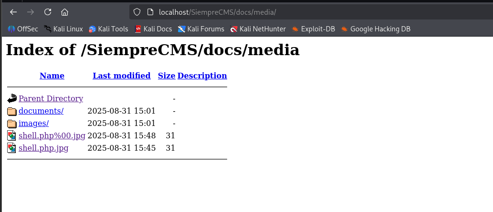

# SiempreCMS-Path-Traversal

### Path Traversal in ``../media../``. This allows reading arbitrary files via directory traversal.
*Source Code:* [SiempreCMS v1.3.6](https://github.com/SiempreCMS/SiempreCMS)

```php
$requestedPath = strtolower(trim($_POST['path']));
if(substr($requestedPath, 0, 9) == '../media/') {
    $path = $requestedPath; 
    // ... no further validation
}
$results = scandir($path);
```

**Exploitation:**
The path validation only checks if it starts with ``../media/``
You can bypass this with: ``../media/../../../../../../etc/passwd``
This allows reading arbitrary files via directory traversal

---

**Evidence:**



